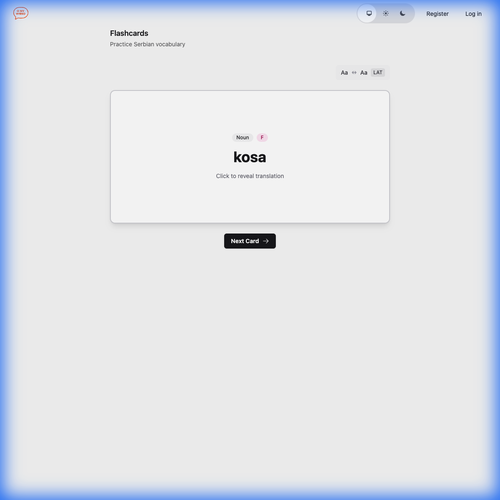

# Srpski — Serbian Language Learning App

A vocabulary learning app for English speakers learning Serbian. Built with Elixir, Phoenix LiveView, and PostgreSQL.

**Live demo:** [link when deployed]

---

## Why I Built This

My son is learning Serbian. Existing apps don't handle Serbian's grammatical complexity well — they treat it like a language with simple vocabulary lists. But Serbian has:

- **7 grammatical cases** (nominative, genitive, dative, accusative, vocative, instrumental, locative)
- **3 genders** that affect adjective and verb agreement
- **Animate/inanimate distinction** for masculine nouns (affects accusative case)
- **Verb aspects** (perfective/imperfective) that change meaning
- **Two scripts** (Latin and Cyrillic) used interchangeably

This app is built on a proper linguistic foundation, not just flashcards.

---

## Screenshot



The badges show grammatical information: **Noun** (part of speech), **M** (masculine gender), **Anim** (animate — affects how accusative case works).

---

## Architecture: "Fake it till you Automate it"

The system uses a two-layer architecture separating linguistic truth from search performance:

| Layer | Table | Purpose |
|-------|-------|---------|
| **Source of Truth** | `vocabulary_words` | Dictionary entries with full linguistic metadata |
| **Search Cache** | `search_terms` | Every searchable form (declensions, conjugations) mapped to root words |

**Example:** The word "pas" (dog) has one entry in `vocabulary_words`, but 14 entries in `search_terms` — one for each declined form (psa, psu, psom, psi, psima, etc.).

When you search for "psa" (genitive/accusative of "dog"), the app finds it in `search_terms` and links back to the root word with full context.

### Why Two Tables?

1. **Correctness** — The source of truth has proper linguistic structure
2. **Performance** — Flat search table is fast
3. **Future-proofing** — A rule engine can regenerate the search cache from the source of truth

### Script Strategy

All data is stored in **Latin script**. Cyrillic is rendered dynamically via transliteration. This keeps the database simple while supporting both scripts in the UI.

---

## The Master Prompt

This project was built using AI-assisted development with detailed specification prompts.

**See:** [docs/MASTER_PROMPT.md](docs/MASTER_PROMPT.md)

The Master Prompt is a comprehensive technical specification that defines:
- Database schema with linguistic accuracy
- Ecto schemas with validation rules
- Transliteration logic for Latin ↔ Cyrillic
- Search behavior and normalization
- Seed data structure

This demonstrates how to translate domain requirements into precise technical instructions that AI can execute reliably.

---

## Tech Stack

- **Elixir** — Functional language, great for this kind of rule-based domain
- **Phoenix LiveView** — Real-time UI without JavaScript complexity
- **PostgreSQL** — Robust, with good support for arrays and JSONB
- **Tailwind CSS** — Utility-first styling

---

## Features

### Working Now
- [x] Flashcard practice with random word selection
- [x] Script toggle (Latin ↔ Cyrillic)
- [x] Grammatical badges (gender, animacy, aspect)
- [x] Search any word form, find the root

### Planned
- [ ] Spaced repetition algorithm
- [ ] Filter by category (animals, food, travel, etc.)
- [ ] Filter by proficiency level
- [ ] Audio pronunciation
- [ ] Declension/conjugation tables on card back

---

## Local Development

```bash
# Install dependencies
mix deps.get

# Create and migrate database
mix ecto.setup

# Start Phoenix server
mix phx.server
```

Visit `http://localhost:4000`

---

## Documentation

- [Master Prompt](docs/MASTER_PROMPT.md) — The specification that guided development

---

## Author

Milorad Felbapov
[LinkedIn](https://linkedin.com/in/YOUR_LINKEDIN) | [GitHub](https://github.com/YOUR_GITHUB)

*Built for my son, who is learning the language of his heritage.*
